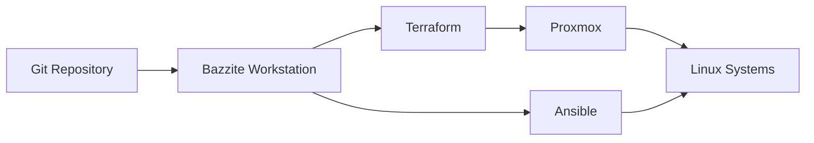

# Infrastructure Automation

This document describes how automation is used in my infrastructure lab to make server deployment, configuration and maintenance more repeatable.

The environment uses **Terraform** and **Ansible** for different responsibilities.

The goal is not to automate everything, but to automate the parts that benefit from consistency, reproducibility and version control.

> This is a sanitized public representation of the environment. Credentials, internal addresses and environment-specific secrets are intentionally excluded.

---

## Automation Goals

The automation model is built around a few principles:

- Reduce repetitive manual configuration
- Make infrastructure easier to recreate
- Keep changes version controlled
- Separate provisioning from configuration
- Reduce configuration drift
- Make troubleshooting easier by keeping configuration explicit
- Prefer readable automation over unnecessary abstraction
- Keep the environment manageable for a single operator

---

# Automation Model

The lab separates infrastructure provisioning and operating-system configuration.

```text
Terraform
   |
   v
Create infrastructure
   |
   v
VM / LXC exists
   |
   v
Ansible
   |
   v
Configure operating system
   |
   v
Deploy services
```

The intended responsibility split is:

| Tool | Primary Responsibility |
|---|---|
| Terraform | Infrastructure provisioning |
| Ansible | Operating system and service configuration |
| Git | Version control and change history |
| SSH | Administration and automation transport |
| Proxmox | Virtualization platform |

This separation keeps each tool focused on the tasks it handles best.

---

# Why Terraform and Ansible

Terraform and Ansible overlap in some areas, but they solve different problems.

Terraform is primarily concerned with the lifecycle of infrastructure resources.

Ansible is primarily concerned with configuring systems after they exist.

For example:

```text
Terraform
    |
    +-- Create VM
    +-- Assign CPU
    +-- Assign memory
    +-- Attach storage
    +-- Configure network interface
    |
    v
VM created
    |
    v
Ansible
    |
    +-- Configure users
    +-- Install packages
    +-- Configure SSH
    +-- Deploy monitoring
    +-- Configure services
```

This avoids turning one tool into a solution for every problem.

---

# Terraform

Terraform is being introduced as the infrastructure provisioning layer.

The long-term objective is to define Proxmox workloads declaratively.

Instead of manually creating the same type of VM repeatedly, infrastructure can be described in code.

Conceptually:

```hcl
resource "proxmox_virtual_environment_vm" "example" {
  name = "example-server"

  cpu {
    cores = 2
  }

  memory {
    dedicated = 2048
  }
}
```

The public repository only contains sanitized examples rather than the complete operational configuration.

---

# Terraform Responsibilities

Terraform is intended to manage resources such as:

- Virtual machines
- LXC containers
- CPU allocations
- Memory allocations
- Storage configuration
- Virtual network interfaces
- VM metadata
- Infrastructure lifecycle

The goal is to make infrastructure creation predictable.

---

# Infrastructure Lifecycle

A workload can conceptually move through the following lifecycle:

```text
Configuration written
       |
       v
terraform plan
       |
       v
Review proposed changes
       |
       v
terraform apply
       |
       v
Infrastructure created
       |
       v
Ansible configuration
```

Using a planning stage before applying infrastructure changes reduces the risk of accidental modifications.

---

# Terraform State

Terraform state is an important part of the automation model.

State represents Terraform's understanding of the infrastructure it manages.

Because it can contain sensitive or environment-specific information, Terraform state is not intended to be published in the public portfolio repository.

Examples of files that should not be committed include:

```text
terraform.tfstate
terraform.tfstate.*
.terraform/
*.tfvars
```

Appropriate `.gitignore` rules are therefore part of the repository structure.

---

# Terraform Variables

Environment-specific values should be separated from reusable configuration.

For example:

```hcl
variable "vm_name" {
  type = string
}

variable "cpu_cores" {
  type = number
}

variable "memory_mb" {
  type = number
}
```

Example values can be provided separately:

```hcl
vm_name   = "example-server"
cpu_cores = 2
memory_mb = 2048
```

Sensitive values should never be hardcoded into publicly committed configuration.

---

# Terraform Design Philosophy

Terraform configuration should remain understandable.

The lab avoids creating complex module structures before there is a real need for them.

The preferred progression is:

```text
Simple resource
      |
      v
Repeated resources
      |
      v
Reusable variables
      |
      v
Module when repetition justifies it
```

This keeps the automation easier to learn and troubleshoot.

---

# Ansible

Ansible is used as the configuration-management layer.

Once a Linux server exists and can be reached over SSH, Ansible can configure it into the required state.

Typical responsibilities include:

- User configuration
- SSH configuration
- Package management
- Service installation
- Monitoring agents
- Application dependencies
- System configuration
- File deployment
- Service management

---

# Ansible Architecture

The current Ansible structure follows a model similar to:

```text
ansible/
├── inventory/
│   └── hosts.yml
│
├── group_vars/
│
├── host_vars/
│
├── roles/
│
└── playbooks/
```

Each section has a clear purpose.

---

# Inventory

The inventory describes systems managed by Ansible.

A sanitized example:

```yaml
all:
  hosts:
    monitoring01:
      ansible_host: 192.0.2.10
    server01:
      ansible_host: 192.0.2.11

  children:
    linux_servers:
      hosts:
        monitoring01:
        server01:
```

The real environment uses environment-specific addresses and settings that are not published publicly.

---

# Group Variables

`group_vars` contains configuration shared by multiple systems.

Example:

```text
group_vars/
└── linux_servers.yml
```

This could contain settings such as:

```yaml
timezone: Europe/Stockholm
common_packages:
  - curl
  - git
  - vim
```

This reduces duplicated configuration.

---

# Host Variables

`host_vars` contains values that apply to a specific server.

Example:

```text
host_vars/
└── monitoring01.yml
```

Possible host-specific values:

```yaml
server_role: monitoring
prometheus_enabled: true
grafana_enabled: true
```

This keeps host-specific settings out of general playbooks.

---

# Roles

Roles are used when configuration becomes reusable enough to justify separation.

Example:

```text
roles/
├── common/
├── node_exporter/
├── prometheus/
└── grafana/
```

A role may contain:

```text
roles/common/
├── tasks/
├── handlers/
├── templates/
├── files/
├── defaults/
└── vars/
```

Roles allow the same configuration logic to be reused across multiple systems.

---

# Playbooks

Playbooks define what configuration should be applied.

Example:

```yaml
- name: Configure Linux servers
  hosts: linux_servers
  become: true

  roles:
    - common
```

A dedicated monitoring deployment could look conceptually like:

```yaml
- name: Configure monitoring server
  hosts: monitoring
  become: true

  roles:
    - prometheus
    - grafana
```

The objective is to keep playbooks short and move reusable logic into roles.

---

# Idempotency

One of the most important automation concepts in the lab is idempotency.

Running the same Ansible playbook multiple times should not continuously change the system.

Example:

```text
First run:
Package missing
    |
    v
Package installed

Second run:
Package already installed
    |
    v
No change
```

This makes automation safer and easier to validate.

---

# Ansible Verification

Automation should not be considered successful simply because the playbook returned without an error.

Changes should be verified.

For example:

```text
Apply configuration
      |
      v
Check service state
      |
      v
Check listening port
      |
      v
Check application health
```

Example validation commands might include:

```bash
systemctl status prometheus
ss -lntp
curl http://localhost:9090/-/healthy
```

The exact validation depends on the service being deployed.

---

# SSH and Automation

Ansible normally communicates with Linux systems through SSH.

The preferred model is:

```text
Administration Workstation
        |
        | SSH key
        v
Linux Server
```

Key-based authentication reduces dependency on interactive passwords and works well with automated workflows.

Private keys are never stored in the repository.

---

# Privilege Escalation

Some configuration requires administrative privileges.

Ansible can use privilege escalation:

```yaml
become: true
```

This allows automation to connect with a normal administrative user and elevate only when required.

The goal is to avoid using root as the default SSH identity where there is no need.

---

# Current Workflow

The administration workstation acts as the main control system.



The workstation is used to run automation, but the infrastructure itself should not depend on the workstation remaining online.

---

# Example Deployment Workflow

A future repeatable deployment could follow this process:

```text
1. Define workload in Terraform
2. Run terraform fmt
3. Run terraform validate
4. Run terraform plan
5. Review proposed infrastructure changes
6. Run terraform apply
7. Verify VM / LXC connectivity
8. Add or update Ansible inventory
9. Run Ansible configuration
10. Verify service health
11. Commit documented changes
```

This gives the deployment process a predictable structure.

---

# Git Workflow

Infrastructure configuration is version controlled using Git.

This provides:

- Change history
- Ability to review modifications
- Easier rollback of configuration files
- Documentation of infrastructure evolution
- A foundation for future CI/CD workflows

A typical workflow is:

```text
Make change
    |
    v
Review diff
    |
    v
Test
    |
    v
Commit
    |
    v
Push
```

Meaningful commit messages are preferred over generic messages such as:

```text
update
fix
changes
```

Example:

```text
Add monitoring host variables
```

or:

```text
Create base Linux configuration role
```

---

# Manual Changes

Not every task must immediately be automated.

Manual configuration may be appropriate when:

- testing a new technology
- troubleshooting
- validating a design
- performing a one-time operation
- understanding how a service works before automating it

The preferred progression is:

```text
Understand manually
       |
       v
Repeat successfully
       |
       v
Document
       |
       v
Automate
```

This avoids automating a process that is not yet understood.

---

# Configuration Drift

Manual changes can create differences between servers over time.

For example:

```text
server01
Package A
Package B

server02
Package A
Package C

server03
Package A
Unknown manual changes
```

Configuration management reduces this problem by defining a desired state.

```text
Ansible desired state
       |
       +---- server01
       +---- server02
       +---- server03
```

This makes the environment more predictable.

---

# Reusability

Automation is designed to become reusable gradually.

For example, instead of creating a separate playbook for every server:

```text
install_tools_server01.yml
install_tools_server02.yml
install_tools_server03.yml
```

a common role can be used:

```text
roles/common
```

with host-specific configuration stored separately.

This produces less duplication and clearer intent.

---

# Secrets

Automation often requires credentials.

Secrets may include:

- API tokens
- passwords
- SSH private keys
- Proxmox credentials
- application credentials

Secrets must remain outside the public repository.

Possible approaches include:

- environment variables
- Ansible Vault
- external secret stores
- locally excluded variable files

The exact method can evolve as the lab becomes more complex.

---

# Ansible Vault

Ansible Vault can be used when encrypted values need to remain alongside Ansible configuration.

Example:

```bash
ansible-vault create secrets.yml
```

Encrypted secrets can then be referenced by playbooks without storing plaintext credentials.

Even encrypted production secret files do not need to be included in the public portfolio repository.

---

# Error Handling

Automation should fail clearly when assumptions are not met.

Examples include:

- expected package repository unavailable
- required variable missing
- service failed to start
- target host unreachable
- application health check failed

Automation that silently ignores failures creates systems that are difficult to trust.

---

# Observability and Automation

Monitoring should be included as part of deployment rather than added manually later.

For example:

```text
Deploy Linux Server
        |
        +--> Configure OS
        |
        +--> Install service
        |
        +--> Install exporter
        |
        +--> Register monitoring
```

This helps ensure that newly deployed systems become observable consistently.

---

# Backup and Automation

Automation and backup solve different problems.

Terraform or Ansible can recreate configuration, but they do not automatically restore application data.

For example:

```text
Terraform
    -> recreate VM

Ansible
    -> configure VM

Backup
    -> restore application data
```

A complete recovery process may require all three.

---

# Current Automation Scope

Current automation work includes:

- Ansible inventory management
- Host-specific variables
- Group-level variables
- SSH-based Linux administration
- Monitoring server configuration
- Infrastructure provisioning experiments with Terraform
- Moving manual server configuration into reusable automation

---

# Planned Improvements

## Reusable Ansible Roles

Expand roles for common server configuration and infrastructure services.

Potential examples:

```text
roles/
├── common
├── node_exporter
├── prometheus
├── grafana
├── docker
└── hardening
```

---

## Proxmox Provisioning

Move more VM and LXC creation into Terraform.

The objective is to reduce manual provisioning through the Proxmox interface.

---

## Bootstrap Workflow

Develop a predictable workflow for taking a server from creation to managed state.

Conceptually:

```text
Terraform
   |
   v
Server
   |
   v
SSH available
   |
   v
Ansible bootstrap
   |
   v
Managed infrastructure
```

---

## Validation

Add more automated validation after deployment.

Examples could include:

- service status checks
- port checks
- HTTP health checks
- Ansible assertions
- Terraform validation

---

## CI Validation

A future improvement is to use GitHub Actions or another CI system to validate infrastructure code.

Potential checks include:

```text
terraform fmt -check
terraform validate
ansible-lint
yamllint
```

CI would validate code without automatically applying infrastructure changes.

For a homelab, automated deployment from a public repository would provide limited benefit and could introduce unnecessary risk.

---

# What I Avoid Automating

Automation is not automatically better.

Examples of things that may remain manual include:

- destructive recovery operations
- major network migrations
- hardware changes
- one-time experiments
- changes requiring careful observation

The objective is to automate repeatable work, not eliminate human review.

---

# Automation Philosophy

The automation strategy follows this progression:

```text
Build
  ↓
Understand
  ↓
Document
  ↓
Repeat
  ↓
Automate
  ↓
Validate
```

The objective is not maximum automation.

The objective is infrastructure that is:

- reproducible
- understandable
- maintainable
- testable
- recoverable

Automation should reduce operational work without hiding how the underlying systems function.