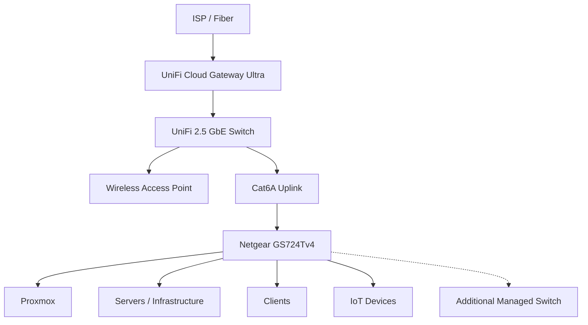
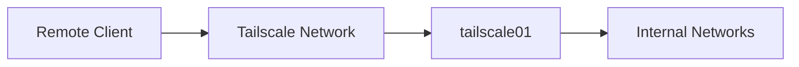

# Network Architecture

This document describes the network design used in my infrastructure lab, including physical topology, switching, routing, segmentation and remote access.

The network is intentionally designed to remain understandable and maintainable while still providing practical experience with VLANs, firewalling, managed switching and infrastructure segmentation.

> This is a sanitized public representation of the environment. Internal IP addresses, MAC addresses and other sensitive information are intentionally excluded.

---

## Network Goals

The network is designed around the following goals:

- Centralize routing and firewall policy
- Separate trusted and untrusted device classes
- Keep infrastructure management predictable
- Avoid unnecessary Layer 3 complexity
- Support managed switching and VLANs
- Allow secure remote access without exposing internal services directly
- Maintain clear troubleshooting boundaries
- Allow the lab to grow without redesigning the entire network

---

# Physical Topology

The fiber connection and gateway are located in a different room from the main homelab equipment.

A small UniFi switch provides connectivity near the gateway, while a dedicated Ethernet uplink connects the gateway-side network to the main lab area.



The main infrastructure equipment can therefore remain grouped together even though the Internet connection enters the home elsewhere.

---

# Core Network Components

## UniFi Cloud Gateway Ultra

The UniFi Cloud Gateway Ultra acts as the central Layer 3 device.

Its responsibilities include:

- Internet routing
- NAT
- DHCP
- Firewalling
- VLAN routing
- Network segmentation
- VPN-related routing
- Network visibility
- Device and traffic management

Routing policy is intentionally centralized here instead of being distributed across switches.

This makes the environment easier to understand and troubleshoot.

---

## UniFi Switching

A UniFi 2.5 GbE switch is located close to the gateway.

Its role is primarily:

- Connecting the gateway to local devices
- Providing the uplink toward the main homelab
- Connecting wireless infrastructure
- Providing higher-speed connectivity where useful

It is not intended to become a second routing layer.

---

## Netgear GS724Tv4

Managed Netgear switches provide the main switching capacity in the lab area.

Their responsibilities include:

- Server connectivity
- VLAN-aware switching
- Tagged and untagged port configuration
- Infrastructure connectivity
- Future expansion

The switches operate primarily at Layer 2.

Routing and firewall decisions remain on the UniFi gateway.

---

# Layer 2 vs Layer 3 Design

The general architecture follows a simple model:

```text
Managed switches
      |
      | Layer 2
      v
UniFi Gateway
      |
      | Layer 3
      v
Routing / Firewalling
```

The goal is to avoid introducing Layer 3 switching unless a clear requirement appears.

For the current scale of the lab, central Layer 3 routing provides a better balance between:

- simplicity
- visibility
- troubleshooting
- security policy management

---

# VLAN Strategy

The network is gradually moving toward logical segmentation.

The exact VLAN structure may evolve, but the intended model separates devices based on trust and role.

```text
Trusted Clients
Infrastructure
IoT
Guest / Untrusted
Management
```

Not every category requires a dedicated VLAN immediately.

Segmentation is introduced when there is a clear security or operational reason.

---

## Trusted Client Network

This network contains normal trusted endpoints.

Examples:

- Personal computers
- Phones
- Tablets
- Administrative workstation

Trusted clients may require access to selected internal services such as:

- Home Assistant
- Grafana
- Infrastructure administration interfaces

This does not automatically mean unrestricted access to every internal system.

---

## Infrastructure Network

Infrastructure systems include workloads such as:

- Proxmox
- Linux servers
- Monitoring
- Tailscale routing services
- Internal administrative services

The infrastructure network should have tighter access rules than a general client network.

The intended model is:

```text
Trusted Client
     |
     | required administration ports
     v
Infrastructure
```

Administrative interfaces should only be reachable from trusted networks or through secure remote-access paths.

---

## IoT Network

Consumer IoT devices represent a different trust level from general-purpose computers.

Examples include:

- Smart TVs
- Robotic vacuum
- Smart-home devices
- Other Internet-connected appliances

The intended policy is:

```text
IoT
 |
 +----> Internet
 |
 X----> Trusted Clients
 |
 X----> Infrastructure
```

IoT devices should generally be able to reach required Internet services while being prevented from initiating connections toward trusted systems.

Exceptions are added only where required.

For example:

```text
Home Assistant
      |
      | explicit required access
      v
IoT Device
```

This creates a more controlled model than allowing unrestricted communication in both directions.

---

# Inter-VLAN Firewalling

Network segmentation is only useful when firewall policy exists between the segments.

The general policy model is:

```text
Deny unnecessary traffic by default
            +
Allow explicit required flows
```

Example:

| Source | Destination | Policy |
|---|---|---|
| Trusted clients | Internet | Allow |
| Trusted clients | Selected infrastructure services | Allow |
| Infrastructure | Internet | Allow where required |
| IoT | Internet | Allow |
| IoT | Trusted clients | Deny |
| IoT | Infrastructure | Deny by default |
| Home Assistant | Required IoT devices | Explicit allow |
| Remote VPN clients | Selected internal services | Allow |

Rules are introduced incrementally and validated after each change.

---

# Proxmox Networking

The Proxmox host connects to managed switching and provides virtual networking to workloads.

Conceptually:

```text
Physical switch
      |
      v
Proxmox NIC
      |
      v
Linux Bridge
      |
      +---- VM
      +---- VM
      +---- LXC
```

The Linux bridge provides connectivity between physical networking and virtual workloads.

Where VLAN-aware networking is used, VLAN tagging can be extended from the physical network into individual virtual workloads.

This allows services to be placed into appropriate network segments without requiring dedicated physical network interfaces for every network.

---

# Virtual Workload Networking

Each VM or LXC receives network connectivity according to its role.

Examples:

```text
Home Assistant
    -> trusted / service network

Monitoring
    -> infrastructure network

Tailscale router
    -> infrastructure network

General Linux services
    -> appropriate service network
```

Network placement is treated as part of workload design rather than something decided after deployment.

---

# Remote Access

Remote access is provided using Tailscale.

A dedicated Linux container acts as part of the remote-access architecture.



This allows internal services to remain private while still being reachable remotely.

The architecture avoids exposing administrative interfaces directly to the public Internet.

---

# Tailscale Subnet Routing

`tailscale01` can advertise selected internal routes into the Tailscale network.

Conceptually:

```text
Remote Client
      |
      v
Tailscale
      |
      v
tailscale01
      |
      v
Internal Subnet
```

This allows access to services that do not run Tailscale themselves.

Subnet routing is preferred over installing VPN clients on every internal service where that would provide little additional value.

---

# Exit Node

The Tailscale infrastructure can also provide exit-node functionality where required.

This allows a remote device to route normal Internet traffic through the home network.

```text
Remote Device
      |
      v
Tailscale
      |
      v
tailscale01
      |
      v
Home Gateway
      |
      v
Internet
```

Exit-node functionality is treated separately from normal subnet routing so that its purpose and security implications remain clear.

---

# DNS

DNS is treated as a core network dependency rather than simply an application feature.

During troubleshooting, DNS is validated independently from IP connectivity.

Example troubleshooting order:

```text
1. Interface / IP
2. Default gateway
3. Route
4. Internet IP connectivity
5. DNS resolution
6. Application
```

This avoids incorrectly diagnosing application problems when the underlying issue is DNS or routing.

---

# DHCP

DHCP is centrally managed through the network gateway.

Where servers require stable addressing, predictable addressing is preferred.

This may be implemented through:

- DHCP reservations
- static addressing where appropriate

The goal is to maintain known server identities without unnecessarily increasing manual configuration.

---

# Wireless Infrastructure

Wireless access is provided separately from the primary gateway location.

The design allows access points to connect through the switching infrastructure rather than requiring the gateway itself to provide all wireless coverage.

This makes the architecture more modular:

```text
Gateway
   |
Switch
   |
Access Point
   |
Wireless Clients
```

Wireless networks can then be mapped to appropriate VLANs as segmentation develops.

---

# Troubleshooting Model

Networking problems are investigated from the lowest practical layer upward.

Example:

```text
Physical link
     ↓
Switch port
     ↓
VLAN membership
     ↓
IP configuration
     ↓
Gateway
     ↓
Routing
     ↓
Firewall
     ↓
DNS
     ↓
Application
```

Typical validation commands on Linux include:

```bash
ip addr
ip route
ping <gateway>
ping 1.1.1.1
getent hosts example.com
```

The objective is to prove each layer before moving further up the stack.

---

# Current Network Improvements

Current and planned improvements include:

- Expanding VLAN segmentation
- Improving IoT isolation
- Documenting inter-VLAN firewall policy
- Assigning infrastructure services predictable addresses
- Improving wireless segmentation
- Documenting switch port roles
- Expanding monitoring of network devices
- Reducing unnecessary trust between device classes

---

# Design Philosophy

The network deliberately avoids enterprise-level complexity that would provide little benefit at this scale.

Technologies are introduced when they provide practical value.

The objective is not to build the most complex network possible.

The objective is to build a network that is:

- understandable
- secure
- maintainable
- observable
- expandable
- useful for learning